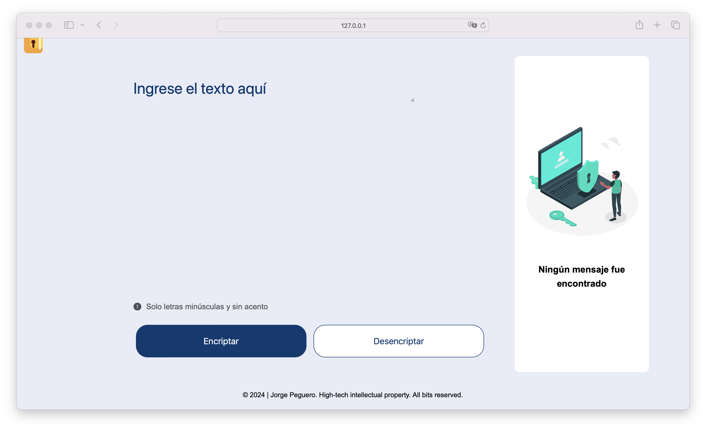
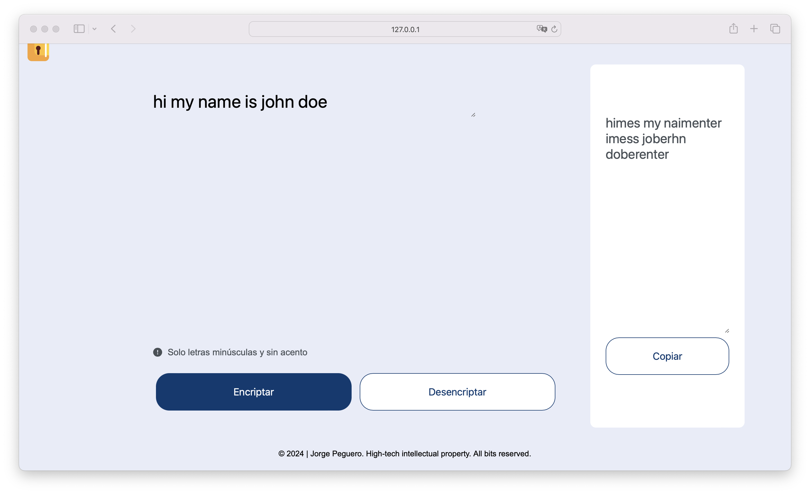
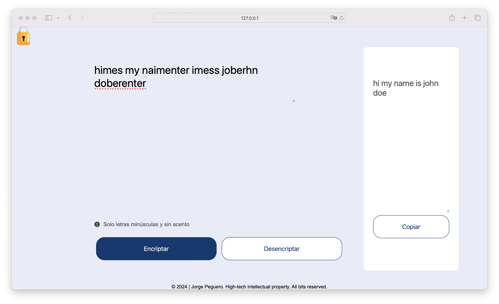

# CipherBox

**CipherBox** is an application designed to encrypt and decrypt text in a straightforward manner. It allows users to enter text into a specific field, where they can easily encrypt it. Additionally, it provides the ability to copy the encrypted text and paste it back to decrypt it. It is useful for anyone needing to protect the privacy of their text through encryption and then retrieve it through the reverse decryption process.

## Screenshots

## Tech Stack

**Client:** HTML, CSS, JavaScript

## Prerequisites

- **Visual Studio Code (VSCode)**: You can download it from [Visual Studio Code](https://code.visualstudio.com/).

## Installation Steps

### Download the project:

1. Download the project from the repository or directly as a ZIP file.

### Open the project in Visual Studio Code:

1. Unzip the ZIP file (if you downloaded the project as a ZIP).
2. Open Visual Studio Code.
3. Select `File` > `Open Folder` and navigate to the downloaded project folder.

### Run the application:

1. If you're only using HTML, CSS, and JavaScript, simply open the `index.html` file in your preferred web browser.
2. Alternatively, you can use the Live Server extension in VSCode to run the application locally:
   - Install the **Live Server** extension from the VSCode marketplace.
   - Right-click the `index.html` file and select `Open with Live Server`.

That's it! You should now be able to see and use the **CipherBox** application in your browser.

## Author

- [@jorgedoiany](https://github.com/jorgedoiany)
